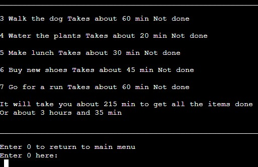

# To Do List

To Do List is exactly what it sounds like it is a to-do list python program that runs in the Code Institute mock terminal on Heroku.

This program lets users keep track of what needs to get done and how long it will take.

[Here is the live version of my project](https://my-to-do-list-one.herokuapp.com/)

## Features

### Existing Features

 - __Main page Feature__

   - Displays all the functions the user can run.

   - Lets the user enter a number corresponding to the function they want to run.

 - __Display you're to do list Feature__

   - Displays all the items on the to-do list.
   - Lets the user return to the main page if they want.

- __Check of items Feature__

   - Displays all the items on the to-do list and prompts the user to enter the number corresponding to the item they are done with.

   - Updates the item that the user is done with.

 - __Add items to list Feature__

   - Lets the user enter a new item to the to-do list and how long they think it's going to take.

   - Adds the new item and time to the list.

 - __Display items that are not done Feature__

   - Displays all the items that the user is not done with.

   - Calculate the time it will take to get all the items done in hours and minutes.

 - __Remove the entire list Feature__

   - Lest the user removes all the items from the list so the user can make a new one.

   - Removes all the data from the list.

### Future Features

- Allow the user to remove a specific item from the to-do list.

- Have a function that handles all the entries and sends them to the prophet function.

## Data Model

## Testing

I have manually tested this project by doing the following:

- Passed the code through the PEP8 linter and confirmed there are no problems.

- Tested all the entry inputs by entering strings when numbers were expected, inputting to high and low numbers, and not inputting anything at all.

- Tested the terminal on GitPod and the Heroku terminal.

### Bugs

#### Solved Bugs

- When I was trying to move the import of the data (from the google sheet) from being in almost every function to just one function and then passing the values to the functions I got an Unused argument error. 

  - I fixed this by filtering the functions so just the functions that needed the data got it.

 

- Hade a bug where the program would not run and did not print any errors in the terminal on GitPod.
   - I fixed this by removing the terminal and adding a new one.

### Remaining Bugs

- No bugs remaining.

### Validator Testing

- __PEP8__

  - No errors were returned from PEP8online.com

## Deployment

This project was deployed using Code Institute's mock terminal for Heroku.

- Steps I took for deployment.
    - Create a new Heroku app.
    - Add config vars. 
    - Add buildpacks: heroku/python and heroku/nodejs.
    - Link the Heroku app to the.
    - Link the Heroku app to the repository you want to deploy.
    - Click on Deploy.

## Credits

- Code Institute for the deployment terminal
- Edwin Reichs thread on Quora for showing me how to put functions in a list and how to call them [Link to thread](https://www.quora.com/How-can-you-make-a-list-of-functions-in-Python)
- alecxes answer on stack overflow for for deepening my understanding on list and sublist [Link to thread](https://stackoverflow.com/questions/25050311/extract-first-item-of-each-sublist)
- And of course all the brilliant folks at Code Institute for giving me this chance on becoming a full stack developer.